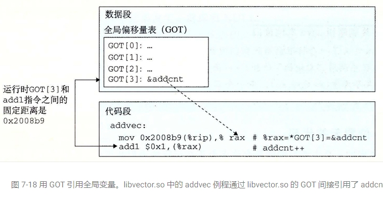
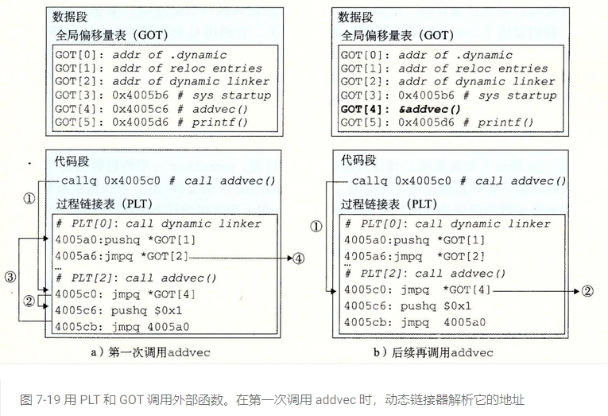

1. C++引用折叠规则：
    只要有左值引用参与，则结果为左值引用。
    否则，结果为右值引用。

2. 内存对齐：

    内存对齐规则
    每个特定平台上的编译器都有自己的默认“对齐系数”（也叫对齐模数）。gcc中默认#pragma pack(4)，可以通过预编译命令#pragma pack(n)，n = 1,2,4,8,16来改变这一系数。

    有效对其值：是给定值#pragma pack(n)和结构体中最长数据类型长度中较小的那个。有效对齐值也叫对齐单位。

    了解了上面的概念后，我们现在可以来看看内存对齐需要遵循的规则：

    (1) 结构体第一个成员的偏移量（offset）为0，以后每个成员相对于结构体首地址的 offset 都是该成员大小与有效对齐值中较小那个的整数倍，如有需要编译器会在成员之间加上填充字节。

    (3) 结构体的总大小为 有效对齐值 的整数倍，如有需要编译器会在最末一个成员之后加上填充字节。  

3. ASLR  
    Linux 中的 ASLR（Address Space Layout Randomization）机制通过对栈、内存映射段、堆的起始地址加上随机偏移量来打乱虚拟地址空间布局，从而增加攻击者猜测系统资源地址的难度，提高了系统的安全性。  

    ASLR 机制会对以下三个部分进行随机化：

    3.1 Random stack offset：Linux 会在进程启动时将栈顶地址随机化，从而防止攻击者通过栈溢出攻击获取程序控制权。  
    3.2 Random mmap offset：Linux 会对每个内存映射段的起始地址进行随机化，从而防止攻击者获取内存映射段的地址，进而执行代码注入等攻击。  
    3.3 Random brk offset：Linux 会对堆的起始地址进行随机化，从而防止攻击者通过堆溢出攻击获取程序控制权。

4.  C++类的构造函数执行顺序：  
    ps：不管是直接还是间接继承了虚基类，只要虚基类不是只有默认的无参构造函数，就需要在初始化列表中对它进行初始化

    执行顺序：  
    4.1 如果该类有直接或者间接的虚基类，则先执行虚基类的构造函数。  

    4.2 如果该类还有其他基类，则按照它们在继承声明列表中出现的次序，分别执行它们的构造函数，但构造过程中，不再执行它们的虚基类构造函数。 

    4.3 按照在类定义中出现的次序，对派生类中新增的成员对象进行初始化。对类类型的成员对象，如果出现在构造函数初始化列表中，则以其中指定参数  
    执行构造函数，如未出现，则执行默认构造函数；对于基本数据类型的成员对象，如果出现在构造函数的初始化列表中，则使用其中指定的值为其赋初值。  
    否则什么也不做。

    4.4 执行自己构造函数的函数体。

5. 为何中文最好使用宽字符  
    在string类型中，其实际上是 typedef basic_string<char> string;
    处理的基本单元为一个字节。对于一个中文字符，通常占两个字节。这是用两个char表示的，就会带来一些问题。

    string s = "这是一个中文字符串"  

    5.1 s.size()的结果是18，这就很不符合常识。  

    5.2. 这种表示方式，一个汉字的第二个字节和下一个汉字的第一个字节仍然能构成汉字。
    比如在GBK编码下，s.substr(3,2)的结果为 “且”  

    5.3 s.find("且")，也能够返回3,（实际上并不存在这个字）。

    所以最好使用宽字符，wchar_t，一个宽字符占两个字节。
    使用对应的宽流输出wcout,wistream,wifstream,wistringstream...（实际上是模板参数<char>换成了<wchar_t>）

6.  无论是采用二进制输出还是文本文件输出，其输出到磁盘的结果本质都是二进制格式，只是文本文件输出，在windows下，每输出一个'\n'，都会自作聪明的添加一个'\r'

7. 语法  
    template<typename... Args>
    void show_list3(Args... args) 

    Args为模板参数包
    args为函数参数包
    1.递归展开（不推荐）  

    2.非递归展开（要用到C++17折叠表达式）  

8. C++11引用折叠规则：  
    只要有左值引用参与折叠，折叠后就是左值引用。

9. 折叠表达式是C++17新引进的语法特性  

    使用折叠表达式可以简化对C++11中引入的参数包的处理，从而在某些情况下避免使用递归。折叠表达式共有四种语法形式。分别为一元的左折叠和右折叠，以及二元的左折叠和右折叠。  

    9.1 一元右折叠(unary right fold)
    ( pack op ... )
    一元右折叠(E op ...)展开之后变为 E1 op (... op (EN-1 op EN))  

    9.2 一元左折叠(unary left fold)
    ( ... op pack )
    一元左折叠(... op E)展开之后变为 ((E1 op E2) op ...) op EN  

    9.3 二元右折叠(binary right fold)
    ( pack op ... op init )
    二元右折叠(E op ... op I)展开之后变为 E1 op (... op (EN−1 op (EN op I)))  

    9.4 二元左折叠(binary left fold)
    ( init op ... op pack )
    二元左折叠(I op ... op E)展开之后变为 (((I op E1) op E2) op ...) op EN  


    op代表运算符，在二元折叠中，两个运算符必须相同。

    pack代表参数包

    init代表初始值

    省略号在包的左边就是左折叠
    省略号在包的右边就是右折叠

10. decltype推导规则  
    decltype(e)（其中e的类型为T）的推导规则有5条：  

    10.1 如果e是一个未加括号的标识符表达式（结构化绑定除外）或者未加括号的类成员访问，则decltype(e)推断出的类型是e的类型T。如果并不存在这样的类型，或者e是一组重载函数，则无法进行推导。  

    10.2 如果e是一个函数调用或者仿函数调用(或者表达式），那么decltype(e)推断出的类型是其返回值的类型。  

    10.3 如果e是一个类型为T的左值，则decltype(e)是T&。cv操作符将被保留。  

    10.4 如果e是一个类型为T的将亡值，则decltype(e)是T&&。  

    10.5 除去以上情况，则decltype(e)是T  

11. 语法
    T&&是万能引用，const T&&不是  
    const T&&允许你重载一个函数模板，它只接受右值引用。  
    如果const T&&也被当做universal reference，那么将没有办法让函数只接受右值引用。

12. 语法
    在函数声明后面加上&符号，表示该方法只能被左值对象调用  

    在函数声明后面加上&&符号，表示该方法只能被右值对象调用  
    ```c++
  struct foo  
    {  
        int i = 42;  
        int  get() && { return i; }  
        int& get() &  { return i; }  
    };  
    ``` 

13. 在《Effective Modern C++》中建议：对于右值引用使用std::move，对于万能引用使用std::forward。


14. 左值和右值  
    
    简单理解，  xvalue就是和右值引用相关的值。prvalue就是不和右值引用相关的，纯右值，也叫临时对象。  

    【纯右值 prvalue】  
    是没有标识符、不可以取地址的表达式，一般也称之为“临时对 象”。最常见的情况有：

    14.11 返回非引用类型的表达式、函数调用  

    14.12 如 x++、x + 1  

    14.13  除字符串字面量之外的字面量如 42、true  


    【将亡值 xvalue】

    14.21 隐式或显式调用函数的结果，该函数的返回类型是对所返回对象类型的右值引用
    ```
    int&& f(){
        return 3;
    }
    ```

    14.22 对对象类型右值引用的转换
    ```
    static_cast<int&&>(7); 
    std::move(7);
    ```

    14.23 类成员访问表达式，指定非引用类型的非静态数据成员，其中对象表达式是xvalue
    ```
    struct As
    {
        int i;
    };

    As&& f(){
        return As();
    }

    int main()
    {
        f().i; 
        return 0;
    }
    ```


15. NRVO.cpp 

    在 C++11 之前，返回一个本地对象意味着这个对象会被拷贝，除非编译器发现可以做返回值优化（named return value optimization，或 NRVO），  能把对象直接构造到调用者的栈上。  

    从 C++11 开始，返回值优化仍可以发生，但在没有返回值优化的情况下，编译器将试图把本地对象移动出去，而不是拷贝出去。这一行为不需要程序员手工用 std::move 进行干预——使用std::move 对于移动行为没有帮助，反而会影响返回值优化。   


16. constexpr函数

    constexpr也可以用于函数。一个constexpr函数是在编译时计算其结果的函数。这意味着函数的所有参数都必须是常量表达式，
    并且函数体中不能有任何会改变状态的语句（例如，赋值语句或递增/递减操作）。
    ```
    constexpr int square(int number) {
        return number * number;
    }

    constexpr int x = square(10);  // 这是合法的，因为square是一个constexpr函数
    ```


17. 动态链接

    * 动态库的数据段和代码段是靠在一起的，它没有和可执行程序的数据段，代码段分别合并，这是与静态链接不同的地方。同一个动态库文件，在两个进程中的虚拟地址并不相同。

    * 什么是GOT表  
    GOT（Global Offset Table）是一个全局偏移表，用于动态链接的过程中解决全局符号的地址引用。[它是在可执行文件或共享库加载到内存时由动态链接器填充的数据结构]。

    程序A引用了动态库中定义的某个全局变量，需要知道其地址，但这个地址又无法在编译链接时确定，因为动态库是运行时期加载的，其地址在运行时期才能确定(实际上还可以编译时链接，此处仅考虑运行时链接这种情况），
    那链接器如何解决该问题？


    动态链接过程中的重定位并不像静态链接那样方便，对于静态链接而言，[重定位过程可以直接修改指令中对数据的引用地址，因为静态链接操作的是 elf 文件]，
    [而动态链接则做不到，因为这时候指令已经被加载到内存中，且映射为[只读]属性]。

    有些朋友就有疑问了，为什么要强行把代码段的数据映射为只读属性，映射成读写属性不行吗，这样动态链接过程就可以直接修改指令了，实际上还真不行。
    一方面，映射为只读属性是出于保护代码不被修改的目的.
    另一方面，如果动态库 A 引用了动态库 B，在重定位过程中修改了动态库 A 中的指令部分，但是，动态库是进程之间共享的，某一个进程修改动态库会导致其它进程的引用出错。

    那么问题来了，如果不能修改指令，那怎么完成重定位过程？毕竟指令中编码的地址是不能直接使用的。答案是通过数据部分进行一次跳转。

    对于所有的进程而言，动态库的数据部分是有独立的一份副本的，这也很好理解，程序的数据部分是读写属性的，对数据的操作由进程说了算，
    所以，在重定位过程中，既然不能修改代码部分，那么我们只能通过修改数据部分来完成重定位的过程。

    这种实现的机制使用了 GOT 表(来源于目标模块代码段，虽然数据段共享，但是代码段不共享），全名为 global offset table，即全局偏移表。在执行的指令中，本来需要引用符号 A ，但是 A 存在于动态库中，
    链接过程并不知道它的地址，于是将 A 的地址部分改写为 GOT 表中某一项数据，在编译阶段 GOT 表中是没有真实数据的，但是在动态链接的加载阶段，
    动态链接器就可以将符号 A 的真实地址填写到 GOT 表中对应的数据项中，这样指令对 A 就产生了正确的引用。

    PS: 增加代理（跳板）是计算机常用的解决问题的手段。

    GOT 中每一个表项占用 4 个字节(32位)，表示运行时的符号的真实地址。

    对于函数而言，可以在加载阶段通过 GOT 表获取到函数的地址保存到寄存器中，然后跳转到该地址，同样可以实现加载时的重定位，但是在实际的指令重定位中，并不单单使用 GOT 表，还使用了另一个 PLT 表实现。

    GOT 表是针对外部符号引用的，而 PLT 针对外部跳转引用，通常就是函数跳转。

    当一个程序需要访问一个全局变量或调用一个外部函数时，编译器无法确定真正的地址，因为这些全局符号的地址是在程序运行时才被分配的。
    为了解决这个问题，编译器将所有涉及全局符号的引用替换成对GOT的间接引用。

    GOT是一个特殊的数据段，存储着全局符号的地址。它是一个数组，每个元素对应一个全局符号的地址。
    在程序启动时，动态链接器会填充GOT中的每个元素，将真正的地址写入其中。这样，当程序需要访问一个全局变量，它实际上是通过间接引用GOT中的对应元素来获取地址。

    GOT的目的是提供一种机制，使得程序中的地址引用可以在动态链接的情况下解决。通过使用GOT，编译器和链接器可以将地址引用的解析延迟到程序运行时，从而支持动态加载和共享库的使用。


18. 动态链接补充  
    共享库的一个主要目的就是允许多个正在运行的进程共享内存中相同的库代码，因而节约宝贵的内存资源。那么，多个进程是如何共享程序的一个副本的呢？一种方法是给每个共享库分配一个事先预备的专用的地址空间片，然后要求加载器总是在这个地址加载共享库。虽然这种方法很简单，但是它也造成了一些严重的问题。它对地址空间的使用效率不高，因为即使一个进程不使用这个库，那部分空间还是会被分配出来。它也难以管理。我们必须保证没有片会重叠。每次当一个库修改了之后，我们必须确认已分配给它的片还适合它的大小。如果不适合了，必须找一个新的片。并且，如果创建了一个新的库，我们还必须为它寻找空间。随着时间的进展，假设在一个系统中有了成百个库和库的各个版本库，就很难避免地址空间分裂成大量小的、未使用而又不再能使用的小洞。更糟的是，对每个系统而言，库在内存中的分配都是不同的，这就引起了更多令人头痛的管理问题。

    要避免这些问题，现代系统以这样一种方式编译共享模块的代码段，使得可以把它们加载到内存的任何位置而无需链接器修改。使用这种方法，无限多个进程可以共享一个共享模块的代码段的单一副本。（当然，每个进程仍然会有它自己的读/写数据块。）

    可以加载而无需重定位的代码称为位置无关代码（Position-Independent Code，PIC）。用户对 GCC 使用 -fpic 选项指示 GNU 编译系统生成 PIC 代码。共享库的编译必须总是使用该选项。

    在一个 x86-64 系统中，对同一个目标模块中符号的引用是不需要特殊处理使之成为 PIC。可以用 PC 相对寻址来编译这些引用，构造目标文件时由静态链接器重定位。然而，对共享模块定义的外部过程和对全局变量的引用需要一些特殊的技巧，接下来我们会谈到。  

    18.1 PIC 数据引用
        编译器通过运用以下这个有趣的事实来生成对全局变量的 PIC 引用：无论我们在内存中的何处加载一个目标模块（包括共享目标模块），数据段与代码段的距离总是保持不变。因此，代码段中任何指令和数据段中任何变量之间的距离都是一个运行时常量，与代码段和数据段的绝对内存位置是无关的。

    想要生成对全局变量 PIC 引用的编译器利用了这个事实，它在数据段开始的地方创建了一个表，叫做全局偏移量表（Global Offset Table，GOT）。在 GOT 中，每个被这个目标模块引用的全局数据目标（过程或全局变量）都有一个 8 字节条目。编译器还为 GOT 中每个条目生成一个重定位记录。在加载时，动态链接器会重定位 GOT 中的每个条目，使得它包含目标的正确的绝对地址。每个引用全局目标的目标模块都有自己的 GOT。

    图 7-18 展示了示例 libvector.so 共享模块的 GOT。addvec 例程通过 GOT[3] 间接地加载全局变量 addcnt 的地址，然后把 addcnt 在内存中加 1。这里的关键思想是对 GOTQ[3] 的 PC 相对引用中的偏移量是一个运行时常量。


    
    因为 addcnt 是由 libvector.so 模块定义的，编译器可以利用代码段和数据段之间不变的距离，产生对 addcnt 的直接 PC 相对引用，并增加一个重定位，让链接器在构造这个共享模块时解析它。不过，如果 addcnt 是由另一个共享模块定义的，那么就需要通过 GOT 进行间接访问。在这里，编译器选择采用最通用的解决方案，为所有的引用使用 GOT。  


    18.2 PIC 函数调用  

    假设程序调用一个由共享库定义的函数。编译器没有办法预测这个函数的运行时地址，因为定义它的共享模块在运行时可以加载到任意位置。正常的方法是为该引用生成一条重定位记录，然后动态链接器在程序加载的时候再解析它。不过，这种方法并不是 PIC，因为它需要链接器修改调用模块的代码段，GNU 编译系统使用了一种很有趣的技术来解决这个问题，称为延迟绑定（lazy binding），将过程地址的绑定推迟到第一次调用该过程时。

    使用延迟绑定的动机是对于一个像 libc.so 这样的共享库输出的成百上千个函数中，一个典型的应用程序只会使用其中很少的一部分。把函数地址的解析推迟到它实际被调用的地方，能避免动态链接器在加载时进行成百上千个其实并不需要的重定位。第一次调用过程的运行时开销很大，但是其后的每次调用都只会花费一条指令和一个间接的内存引用。

    延迟绑定是通过两个数据结构之间简洁但又有些复杂的交互来实现的，这两个数据结构是：GOT 和过程链接表（Procedure Linkage Table，PLT）。如果一个目标模块调用定义在共享库中的任何函数，那么它就有自己的 GOT 和 PLT。GOT 是数据段的一部分，而 PLT 是代码段的一部分。

    图 7-19 展示的是 PLT 和 GOT 如何协作在运行时解析函数的地址。首先，让我们检查一下这两个表的内容。

    * 过程链接表（PLT）。PLT 是一个数组，其中每个条目是 16 字节代码。PLT[0] 是一个特殊条目，它跳转到动态链接器中。每个被可执行程序调用的库函数都有它自己的 PLT 条目。每个条目都负责调用一个具体的函数。PLT[1]（图中未显示）调用系统启动函数（__libc_start_main），它初始化执行环境，调用 main 函数并处理其返回值从 PLT[2] 开始的条目调用用户代码调用的函数。在我们的例子中，PLT[2] 调用 addvec，PLT[3]（图中未显示）调用 printf。

    * 全局偏移量表（GOT）。正如我们看到的，GOT 是一个数组，其中每个条目是 8 字节地址。和 PLT 联合使用时，GOTfO] 和 GOT[1] 包含动态链接器在解析函数地址时会使用的信息。GOT[2] 是动态链接器在 ld-linux.so 模块中的入口点。其余的每个条目对应于一个被调用的函数，其地址需要在运行时被解析。每个条目都有一个相匹配的 PLT 条目。例如，GOT[4] 和 PLT[2] 对应于 addvec。初始时，每个 GOT 条目都指向对应 PLT 条目的第二条指令。

        


        图 7-19a 展示了 GOT 和 PLT 如何协同工作，在 addvec 被第一次调用时，延迟解析它的运行时地址：

        * 第 1 步。不直接调用 addvec，程序调用进入 PLT[2]，这是 addvec 的 PLT 条目。

        * 第 2 步。第一条 PLT 指令通过 GOT[4] 进行间接跳转。因为每个 GOT 条目初始时都指向它对应的 PLT 条目的第二条指令，这个间接跳转只是简单地把控制传送回 PLT[2] 中的下一条指令。

        * 第 3 步。在把 addvec 的 ID（0x1）压入栈中之后，PLT[2] 跳转到 PLT[0]。

        * 第 4 步。PLT[0] 通过 GOT[1] 间接地把动态链接器的一个参数压入栈中，然后通过 GOT[2] 间接跳转进动态链接器中。动态链接器使用两个栈条目来确定 addvec 的运行时位置，用这个地址重写 GOT[4]，再把控制传递给 addvec。

        图 7-19b 给出的是后续再调用 addvec 时的控制流：

        * 第 1 步。和前面一样，控制传递到 PLT[2]。

        * 第 2 步。不过这次通过 GOT[4] 的间接跳转会将控制直接转移到 addvec。

19. 关于PLT表GOT表的个人理解
    g++在编译动态库A时，加上-fPIC选项会生成位置无关代码。
    此时A会生成PLT表和GOT表,GOT表是全局偏移量表,PLT表是过程链接表，用于延迟绑定。

    GOT表：通常保存动态库A里对【外部过程】和对【外部变量】的绝对地址（生成位置无关代码时，也可为所有的引用使用 GOT，【包括内部定义的函数变量】，这点没说清楚。）
    比如，动态库A，引用了动态库B的函数FunB，此时在动态库A中就会生成对应PLT和GOT条目

    PLT表：用于延迟绑定。
    第一次调用某函数会比较慢，因为要进入PLT表，经过一系列步骤，找到函数地址，然后绑定到GOT表。
    往后每次调用，直接从PLT表跳到GOT表，再跳到GOT表里保存的函数地址。

    如何找到GOT表：
    动态库A无论被加载到内存中的何处，其数据段与代码段的距离总是保持不变。其代码段中任何指令和数据段中任何变量之间的距离都是一个运行时常量，与代码段和数据段的绝对内存位置是无关的。
    所以执行到某句指令时，能够根据偏移直接跳到GOT表。

    为什么要延迟绑定：
    存在很多用不上的函数，每次启动都去填写这些GOT表会很耗时，所以才用延迟绑定，用的时候再去找。

    可执行程序C调用外部函数FunA：
    可执行程序C在某段代码用了外部FunA函数，一定是来源于动态库，所以编译时一定会生成GOT表项。

    因为现在C已经是可执行程序了，已经是.out了，现在还存在未解析的函数地址，那一定是来自于动态链接，不可能是静态链接，静态链接是在成为可执行程序前，把一堆.o文件打包进去。
 
    GOT 表中的条目只有在动态链接场景下才会被生成，静态链接时不会生成 GOT 表项。

    .o文件是可重定位的对象文件，不是可执行文件 
    .so是可执行文件 
20. 彻底理解！！！
    * .o是可重定位文件，在静态链接的时候，地址重定位时，直接修改代码段就行了。

    * 但是so,.out都是可执行文件，可执行文件运行起来后，代码段是只读的，不可修改的。

    * 所以， .so生成的位置无关代码里，不含绝对地址，全部是相对地址。
    如果.so用绝对地址，那么每次就必须要加载到进程空间的指定位置，才能正常工作，因为其代码段不能修改，所以无法像.o一样重定位。

    * 不管.so加载到哪里，它的代码段和数据段的相对位置是固定的。那么在.so数据段设置一个GOT表，把在代码段对外部函数/变量的调用，改为查找got表。
    got表里的绝对地址，可以在链接时确定，链接器很牛，它知道所有函数所有外部变量此时的实际地址，链接的时候把它填入GOT表即可。

    比如 调用Fun 变为 跳到（当前指令地址 + 对应GOT的偏移） 这句代码就实现了位置无关
参考资料：[深入理解计算机系统CSAPP](https://docs.python.org/zh-cn/3/tutorial/index.html)

21. 延时装入动态依赖项
    
    在内存中装入动态库时，将会检查该目标文件的任何其他依赖项。缺省情况下，将立即装入存在的所有依赖项。此循环会一直继续，直到找遍整个依赖项树为止。最后，解析由重定位指定的所有目标文件间数据引用。无论应用程序在执行期间是否引用了这些依赖项中的代码，都会执行这些操作。

    在延迟装入模型中，标记为延迟装入的所有依赖项仅在显式引用时装入。通过利用函数调用的延迟绑定，依赖项装入将会一直延迟，直到第一次引用该函数。因此，绝不会装入从不引用的目标文件。

    重定位引用可以是即时的，也可以是延迟的。因为初始化目标文件时必须解析即时引用，所以必须即时装入满足此引用要求的任何依赖项。因此，将这类依赖项标识为延迟可装入几乎没有效果。 请参见执行重定位的时间。通常，建议不要在动态库之间进行即时引用。

    链接编辑器对调试库 liblddbg 的引用将使用延迟装入。由于不会经常进行调试，因此每次调用链接编辑器时装入此库既无必要又需要很大开销。通过指示可以延迟装入此库，处理库的开销将转至要求调试输出的那些调用。

    实现延迟装入模型的替代方法是在需要时使用 dlopen() 和 dlsym() 来装入并绑定到依赖项。如果 dlsym() 引用数很少，则此模型非常理想。如果在链接编辑时不知道依赖项名称或位置，则此模型也很适用。对于更复杂的与已知依赖项的交互，对正常符号引用进行编码并指定要延迟装入的依赖项更为简单。

    通过链接编辑器选项 -z lazyload 和 -z nolazyload，可将目标文件分别指定为延迟装入或正常装入。这些选项在链接编辑命令行上与位置相关。该选项之后的任何依赖项都将采用其指定的装入属性。缺省情况下，-z nolazyload 选项有效。

    总结：延迟装入可以用 dlopen() 和 dlsym() 实现，也可以用链接器选项-z lazyload 实现

22. 布隆过滤器
    布隆过滤器（Bloom Filter）是一种空间效率非常高的概率型数据结构，用于快速判断某个元素是否存在于集合中。它可以大幅减少内存占用，但会有一定的误报率（可能错误地判断某个不存在的元素为存在）。不过，它绝不会产生漏报（即不会错误地判断一个存在的元素为不存在）。

    22.1. 基本原理
    布隆过滤器使用的是位数组和多个哈希函数。其工作原理如下：

    初始化：布隆过滤器由一个长度为 m 的位数组（bit array）组成，所有位初始化为 0。
    添加元素：
    对要添加的元素用 k 个不同的哈希函数分别计算哈希值，每个哈希函数输出一个位数组的索引值。
    将这 k 个哈希函数生成的索引对应的位数组位置置为 1。
    检查元素是否存在：
    对查询的元素使用相同的 k 个哈希函数计算哈希值，得到 k 个索引。
    检查这些索引对应的位在位数组中是否都为 1，如果其中有一位为 0，则可以肯定该元素不在集合中。
    如果所有位都为 1，则有可能该元素在集合中，但也可能是哈希冲突导致的误报。
    22.2 优势
    空间效率高：相比于直接存储集合中的所有元素，布隆过滤器可以使用非常少的内存。
    查询速度快：布隆过滤器查询操作只需进行 k 次哈希计算和 k 次位检查，速度非常快。
    支持多种场景：可以用来处理大数据、缓存系统、爬虫的URL去重、数据库的键存在性判断等场景。
    22.3 劣势
    误报率：布隆过滤器可能会错误地判断某个不存在的元素为存在。误报率随着位数组长度 m 和哈希函数数量 k 的不同而不同，但可以通过合理选择这两个参数来降低误报率。
    无法删除元素：标准的布隆过滤器不支持删除元素，因为位数组中设置的 1 可能是多个元素的哈希结果。
    需要多个哈希函数：布隆过滤器的效果依赖于哈希函数的设计，使用质量较差的哈希函数可能导致较高的冲突率，增加误报。

23. C++中逗号运算符优先级最低

24. 补码是怎么来的：
    比如时钟有12个刻度， 要拨到11点，有两种方式
    1. 12逆时针方向拨1个刻度，
    2. 12顺时针方式拨11个刻度
    模为12时，12 -1 = 12 -1 +12
    (举个理解一下模的概念
        三个二进制位，能表示0-7的数，模为8，比如5和5+8，是一样的
        5：101
        5 + 8: 101 + 111 + 1
        101+ 111: (1)100 进位自然丢失
        101 + 111 +1: 100 + 1 = 101
        
        即加上模数以后，由于n位数最多只能体现n位，又循环回来了，所以和原来的数相同
    )
    
    现在解释补码，
    考虑8位二进制数，最高位为符号位，剩下7位的范围是 000 0000 - 111 1111 一共2的7次方个数，128个数。模为128
    -3 和 -3 +128 在运算中作用是相同的，不考虑符号位 -3(原码) + 128 其实就是-3的补码
    -3原码: 1000 0011
    -3补码：1111 1101 (其实就是128 -3 = 125)

    补码 = 原码取反+1 怎么来的？ 现在证明
    还是考虑上面那个例子，原码7位数值位， 模肯定就是2的七次方，即 1000 000 (有多少位就有多少个0 最左边补上一个1)
    即
    模 - 7位数值位 = 补码
    1000 0000 - 7位数值位 = 补码
    1000 0000 - 7位数值位 - 1 = 补码 - 1
    (111 1111 - 7位数值位) = 补码 - 1
    (这个操作其实就是7位数值位取反) = 补码 - 1
    补码 = 数值位取反 + 1

    关于溢出：
    1. n位正 + n位负 一定不会溢出，一定不会超出模的表示范围 000...000 - 111...111
    2. n位正 + n位正 符号位有进位， 即0 变成了1，肯定超模了，溢出了 肯定大于111...111 这个范围了
    3. n位负 + n位负 符号位没进位， 肯定溢出了。
    因为负数是补码表示的 【补码1数值位】+【原码2数值位】 + 【补码2数值位】+【原码2数值位】 = 2*模 
    现在没进位，说明【补码1数值位】+【补码2数值位】 < 模 
    则【原码1数值位】+【原码2数值位】 > 模
    比如 3位二进制数， (-5) + (-5) = -10 原码两个5相加大于模8 肯定溢出了 结果不对

    总的来说，符号位01改变了，就说明溢出了

25. 实用的位运算
    对于任意x，不管正负都成立(可以自己动手算算) 
    x & (−x) 可以获得 x 的二进制表示中的最低位的 1 的位置；

    x & (x−1) 可以将 x 的二进制表示中的最低位的 1 置成 0。

    为啥-1看着这么突兀，计算机中负数都用补码表示，-1其实就是11111(n位)
    即n位的x + n位的1

26. 随机访问迭代器才支持+1、-1，非随机访问双向迭代器只能++或者--，如果是双向迭代器，可以用std::prev(it)获取it前一个位置;

27. C++未初始化的局部变量，数组，int,bool等等等等，值都是随机的，不作保证。比如数组int a[100] ={}，只能全部初始化为0，对于bool类型也就是全为false。
    如果写成int a[100] = {1},只有第一个元素才会被初始化。未初始化的全局变量值为0

28. C++多重继承和类的组合使用场景
    * 多重继承比单一继承复杂。它可能导致歧义，以及对虚继承的需要
    * 虚继承会增加大小，速度，初始化(或赋值)复杂度等成本。如果虚基类不带任何数据，将是最具实用价值的情况
    * 多继承的确有正当用途。其中一个情节涉及"public 继承某个接口类" 和 "private继承某个协助实现的类"的两相组合